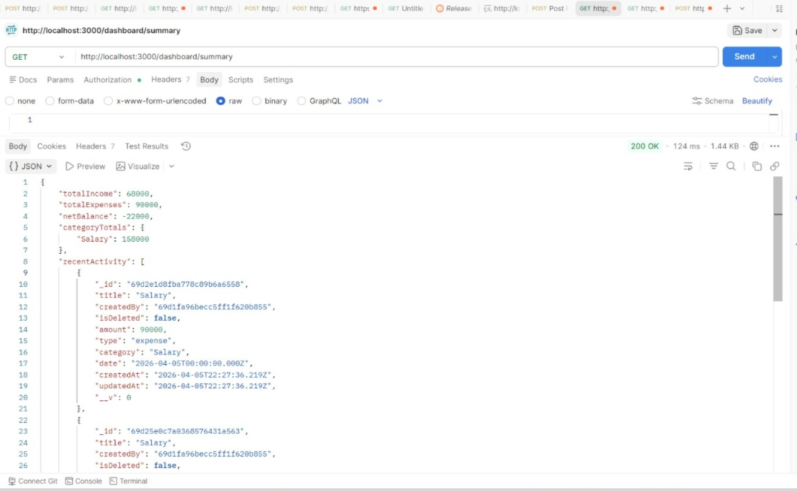
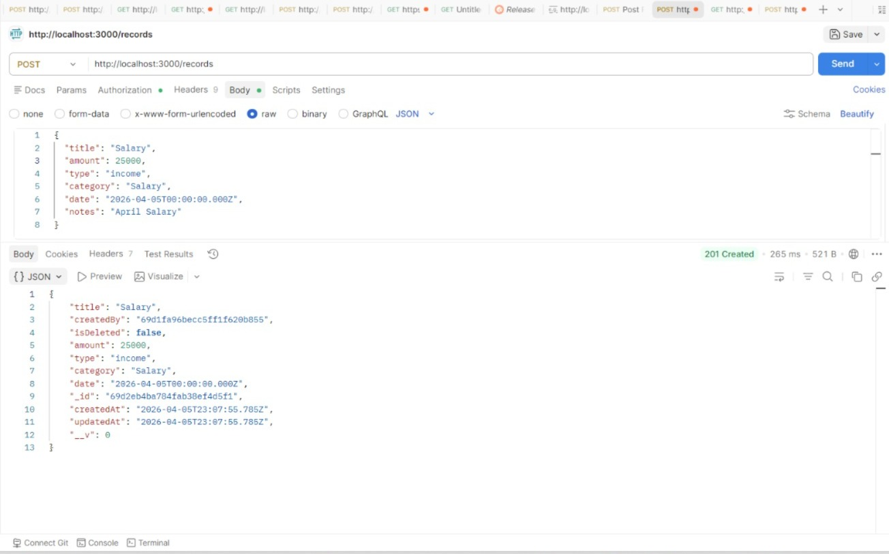

# Zorvyn Backend

This is the **Zorvyn Backend API**, built with **NestJS** and **MongoDB (Atlas)** for managing records, users, dashboards, and authentication with role-based permissions and logging.

## Features

* **User Authentication & Authorization**: JWT-based auth with roles and permissions.

  * Register via **OTP verification**
  * Login to receive JWT
* **Role Management**: Viewer, Analyst, Admin with hierarchical permissions.
* **Records Management**: Full CRUD with soft delete.
* **Dashboard Summary**:

  * Total income & expenses
  * Net balance
  * Category totals
  * Recent activity (last 5 records)
  * Filter by period: `weekly` or `monthly`
* **Logs**: Automatically created for all record actions (create, update, delete).
* **MongoDB Integration**: All data stored in Atlas.

---

## Roles & Permissions

| Role    | Permissions                                                                                          |
| ------- | ---------------------------------------------------------------------------------------------------- |
| Viewer  | `view_record`, `view_user`                                                                           |
| Analyst | Viewer permissions + `view_dashboard`                                                                |
| Admin   | Analyst permissions + `create_record`, `update_record`, `delete_record`, `view_logs`, `manage_roles` |

---

## API Endpoints

### **Authentication / Users**

| Method | Route              | Description                                     |
| ------ | ------------------ | ----------------------------------------------- |
| POST   | `/auth/register`   | Register user via OTP verification              |
| POST   | `/auth/verify-otp` | Verify OTP and activate account                 |
| POST   | `/auth/login`      | Login and get JWT token                         |
| GET    | `/users`           | Get all users (requires `view_user` permission) |

---

### **Records**

| Method | Route          | Roles                  | Permissions   | Description        |
| ------ | -------------- | ---------------------- | ------------- | ------------------ |
| POST   | `/records`     | Admin, Analyst         | create_record | Create a record    |
| GET    | `/records`     | Admin, Analyst, Viewer | view_record   | Get all records    |
| GET    | `/records/:id` | Admin, Analyst, Viewer | view_record   | Get single record  |
| PATCH  | `/records/:id` | Admin, Analyst         | update_record | Update record      |
| DELETE | `/records/:id` | Admin, Analyst         | delete_record | Soft delete record |

---

### **Dashboard**

| Method | Route                | Roles                  | Permissions    | Description                                |
| ------ | -------------------- | ---------------------- | -------------- | ------------------------------------------ |
| GET    | `/dashboard/summary` | Viewer, Analyst, Admin | view_dashboard | Get dashboard summary (weekly/monthly/all) |

---

### **Logs**

* Logs are automatically generated by `LogsService` for all record operations.

---

## Database (MongoDB Atlas)

* **Collections**:

  * `users`
  * `roles`
  * `permissions`
  * `records`
  * `logs`

* **Record Schema**:

```ts
@Schema({ timestamps: true })
export class Record {
  @Prop({ required: true }) title: string;
  @Prop() description: string;
  @Prop({ type: String, ref: 'User', required: true }) createdBy: string;
  @Prop({ default: false }) isDeleted: boolean;
  @Prop({ required: true }) amount: number;
  @Prop({ required: true, enum: ['income', 'expense'] }) type: string;
  @Prop({ required: true }) category: string;
  @Prop({ default: () => new Date() }) date: Date;
}
```

---

## Setup

1. Clone repo:

```bash
git clone <repo-url>
cd zorvyn-backend
```

2. Install dependencies:

```bash
npm install
```

3. Configure environment variables:

```env
JWT_SECRET=SECRET_KEY
MONGO_URI=<your-mongodb-atlas-uri>
```

4. Run the server:

```bash
npm run start:dev
```

---

## Usage Notes

* Ensure all records have `date` set (default applied for new records).
* Dashboard summary fetches records **created by the logged-in user**.
* `totalIncome` and `totalExpenses` are calculated dynamically based on `type` field (`income` or `expense`).
* Roles & permissions are **auto-upserted** on startup or via Mongo shell script.

---

## Example Dashboard Response

```json
{
  "totalIncome": 68000,
  "totalExpenses": 5000,
  "netBalance": 63000,
  "categoryTotals": {
    "Salary": 68000,
    "Food": 5000
  },
  "recentActivity": [
    {
      "_id": "69d25e0c7a0368576431a563",
      "title": "Salary",
      "amount": 30000,
      "type": "income",
      "category": "Salary",
      "createdBy": "69d1fa96becc5ff1f620b855",
      "date": "2026-04-05T22:21:48.459Z"
    }
  ]
}
```


**DEMO**

### Dashboard


### Records API



## References

### NestJS

* **Controllers & Routing** – For route handling and decorators
  [https://docs.nestjs.com/controllers](https://docs.nestjs.com/controllers)

* **Guards & Authorization** – JwtAuthGuard, RolesGuard, PermissionsGuard
  [https://docs.nestjs.com/guards](https://docs.nestjs.com/guards)

* **Custom Decorators** – @Roles() aur @Permissions()
  [https://docs.nestjs.com/custom-decorators](https://docs.nestjs.com/custom-decorators)

* **Passport & JWT Integration** – authentication
  [https://docs.nestjs.com/security/authentication](https://docs.nestjs.com/security/authentication)

* **Dependency Injection & Services** – RecordsService, LogsService
  [https://docs.nestjs.com/providers](https://docs.nestjs.com/providers)

---

### MongoDB

* **Schemas & Models** – @Schema(), Prop(), indexes
  [https://mongoosejs.com/docs/guide.html](https://mongoosejs.com/docs/guide.html)

* **Querying Documents** – find(), findOne(), updateOne()
  [https://mongoosejs.com/docs/queries.html](https://mongoosejs.com/docs/queries.html)

* **Timestamps & Defaults** – createdAt, updatedAt
  [https://mongoosejs.com/docs/guide.html#timestamps](https://mongoosejs.com/docs/guide.html#timestamps)

* **Validation** – required fields, enums
  [https://mongoosejs.com/docs/validation.html](https://mongoosejs.com/docs/validation.html)

